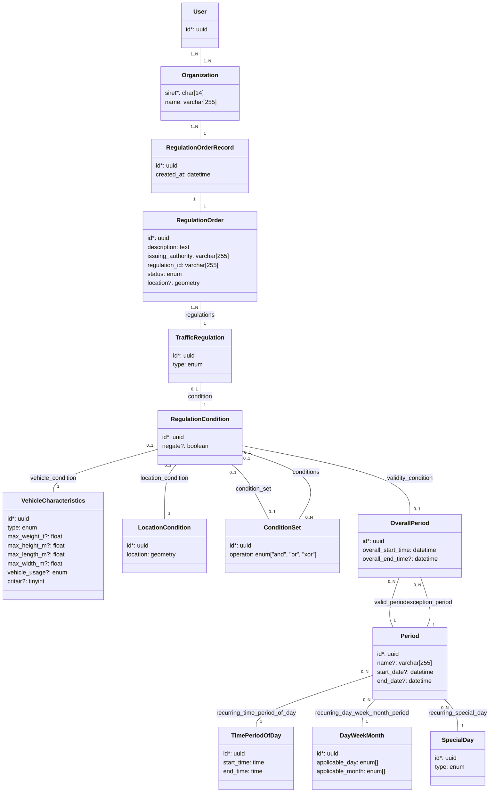

# Format d'échange de données

<!-- OBLIGATOIRE -->

* Date : 2022-11-09
* Personnes impliquées : Florimond Manca, Mathieu Marchois
* Statut : BROUILLON <!-- [BROUILLON|ACCEPTÉ|REJETÉ|DÉPRÉCIÉ] -->

**Table des matières**

* [Contexte](#contexte)
  * [Contraintes](#contraintes)
  * [Hypothèses](#hypothèses)
* [Décision](#décision)
* [Conséquences](#conséquences)
* [Options envisagées](#options-envisagées)
  * [Option 1 - Réutilisation de DATEX II](#option-1---réutilisation-de-datex-ii)
  * [Option 2 - Adaptation ad-hoc de DATEX II](#option-2---adaptation-ad-hoc-de-datex-ii)
  * [Option 3 - Utilisation de TN-ITS](#option-3---utilisation-de-tn-its)
* [Références](#références)

## Contexte

<!-- OBLIGATOIRE -->

DiaLog publiera des données d'arrêtés de circulation qui seront utilisées par des services numériques d'aide au déplacement pour prendre en compte par exemple les restrictions poids lourds.

Nous devons donc décider d'un format de données à utiliser.

Faut-il créer un format ad-hoc, ou y a-t-il des standards reconnus sur lesquels s'appuyer ? Dans ce cas, faut-il les réutiliser directement, ou en produire une adaptation ?

### Contraintes

* Favoriser les standards existants.
* Être compatible avec l'outillage et la connaissance habituelle des contributeurs BetaGouv (exemples : JS, Python, APIs JSON, dépôts git, bases de données relationnelles).
* Pouvoir travailler sur le schéma de données avec un outillage libre. Exemple : ne pas nécessiter une installation Windows ou autre logiciel propriétaire pour être modifié.

### Hypothèses

* Pas de contrainte sur le format de données de la part des services numériques d'aide au déplacement. Ils sont éventuellement familiers des standards existants.

## Décision

<!-- OBLIGATOIRE -->

_TODO_

## Conséquences

* La documentation sera mise à jour.
* Le modèle conceptuel de données (MCD) de DiaLog devra permettre que l'API expose les données au format choisi. Cela sera facilité s'il adopte une terminologie et une structure proches du format choisi.
* Le format choisi sera documenté publiquement dans un schéma de données au format JSONSchema, en vue par exemple d'une publication sur https://schema.data.gouv.fr.
* ...

## Options envisagées

### Option 1 - Réutilisation de DATEX II

Il s'agit d'utiliser directement le schéma de données défini par DATEX II, notamment dans le package [TrafficRegulation](https://docs.datex2.eu/trafficregulation/index.html).

En guise de checklist, voici des réponses aux questions que le [tutoriel DATEX II](https://docs.datex2.eu/using/index.html) recommande de se poser :

| Question | Réponse |
|---|---|
| _With who are you going to Exchange?_ | Les services numériques d'aide au déplacement ("GPS") devant intégrer des restrictions poids lourds. |
| _What road network?_ | **TBD** |
| _What information_ ? | Réglementation associée à des arrêtés de circulation routière |
| _Do you really collect the information?_ - Elle existe dans des fichiers éparses et sera en effet a priori stockée par DiaLog |
| _Is there a digitalised road network available (sustainable)?_ <br> (Un réseau routier numérisé existe-t-il déjà ?) | Non |
| _Agree on the language_ | English |
| _Agree on the information profile + maintenance_ <br>(Quelle sous-partie de DATEX II sera utilisée et comment sera-t-elle maintenue) | **TBD** |
| _Operations supported_ | **TBD** |
| _Timeliness requirements_ | **TBD** |
| _Strong coupled or loose_ | (?) **TBD** |
| _Location referencing method to be used_ | (?) **TBD** |

#### 1.1 - Profil

[Comme suggéré par DATEX II](https://docs.datex2.eu/profiling/index.html), nous n'utiliserons qu'une sous-partie de ce standard.

* Tous les champs de `TrafficRegulation` ne seront donc pas nécessairement utilisés.
* En revanche, toute information que l'on exposera le sera au format défini par ce package, sous peine d'incompatibilité avec le standard.

En langage DATEX II, il s'agit donc de définir le **profil** (_profile_) qui sera utilisé par DiaLog. Ce profil pourra être validé à l'aide de l'outil [DATEX II Reference Advice and Validation Framework (RAV Testcenter)](https://docs.datex2.eu/ravtestcentre/).

La définition de ce profil est hors périmètre de cette décision.

Néanmoins, une base de travail est fournie avec cet ADR : voir [datex2_profile](data/001_exchangeformat/datex2_profile).

Pour recréer ces fichiers à partir d'un fichier de sélection `selection.sel` fourni :

* Se rendre sur le [Webtool DATEX II](https://webtool.datex2.eu/wizard/).
* "1. Source" - Choisir V3.3 DATEX II.
* "2. Selection file" - Cliquer sur l'onglet "Your own selection", puis uploader le fichier de sélection.
* "3. Profile Selection" - Cliquer sur "Next".
* "4. Profile Location" - Cliquer sur "Next".
* "5. Selection" - Vérifier que seul TrafficRegulationPublication est coché, puis cliquer sur "Next".
* "6. Options" - Choisir JSONSchema, puis cliquer sur "Next" pour télécharger le `.zip` avec les fichiers JSONSchema.

Par ailleurs, un travail sur le modèle conceptuel de données (MCD) a abouti à la modélisation suivante (visualiser sur https://mermaid.live):



Ce travail fait apparaître que nous réutiliserons très probablement les entités suivantes :

| Entité DATEX II | Entité dans l'ébauche de MCD |
|---|---|
| `DATEXII_3_TrafficRegulation.json#/definitions/TrafficRegulationOrder` | `RegulationOrder` |
| `DATEXII_3_TrafficRegulation.json#/definitions/TrafficRegulation` | `TrafficRegulation` |
| `DATEXII_3_TrafficRegulation.json#/definitions/ConditionSet` | `ConditionSet` |
| `DATEXII_3_TrafficRegulation.json#/definitions/VehicleCondition` | `VehicleCharacteristics` directement (`VehicleCondition` est un objet contenant seulement une propriété `vehicleCharacteristics`) |
| `DATEXII_3_TrafficRegulation.json#/definitions/LocationCondition` | Modèle simplifié pointant directement vers une `LocationReference` utilisée comme `implementedLocation` |
| `DATEXII_3_TrafficRegulation.json#/definitions/ValidityCondition` | Association entre `RegulationCondition` et une `OverallPeriod` |
| `DATEXII_3_Common.json#/definitions/Validity` | Modèle simplifié pointant directement vers une `OverallPeriod`. Équivalent à une `Validity` avec `validityStatus` valant `"definedByValidityTimeSpec"` et une `validityTimeSpecification` utilisant cette `OverallPeriod` |

#### 1.2 Modélisation des emplacements

La méthode de [_location referencing_](https://docs.datex2.eu/location/index.html) sera **TODO**.

Comment choisir ? Les méthodes possibles :

* [AlertC (TMC)](https://docs.datex2.eu/location/2_Alert-C.html) ([blog](https://medium.com/swlh/location-referencing-tmc-alert-c-6490c25dfd7)) - Information trafic événementiel, comme ce qui déclenche le RDS sur les autoradios. Probablement pas adapté.
* [TPEG](https://docs.datex2.eu/location/3_TpegLoc.html) (CEN ISO/TS 18234-6 et CEN ISO/TS 24530-2) - Format maintenu par l'association TISA, défini dans des normes ISO, voir [TPEC (tisa.org)](https://tisa.org/technologies/tpeg/)
* [Linear referencing](https://docs.datex2.eu/location/4_LinearReferencing.html) (EN ISO 19148) : ligne, point A, point B, direction)
* [OpenLR](https://docs.datex2.eu/location/5_OpenLR.html) ([site](http://www.openlr.org/), [norme ISO](https://www.iso.org/standard/63122.html))
* [GML](https://docs.datex2.eu/location/7_Gml.html) (OpenGIS Geography Markup Language) ([site](https://www.ogc.org/standards/gml)) - Format XML ouvert d'échange de données géographiques.

* Une combinaison de ces formats

DATEX II permet alors modéliser les emplacements suivants :

1. Aire (`AreaLocation`), représentée par exemple par une string OpenLR :

    ```jsonc
    {
      "openlrAreaLocationReference": "" // TODO : exemple
    }
    ```

1. Emplacement sur le réseau (`NetworkLocation`)

    1. Emplacement linéaire (`LinearLocation`), représenté par exemple par une string OpenLR :

        ```jsonc
        {
          "openlrLinear": "" // TODO : exemple
        }
        ```

    1. Emplacement ponctuel (`PointLocation`), représenté par exemple par coordonnées GPS lat/lon :

        ```jsonc
        {
          "pointByCoordinates": {
            "pointCoordinates": {
              "latitude": 0.0, // float
              "longitude": 0.0 // float
            }
          }
        }
        ```

#### 1.3 Extensions

Si, au cours des développements, nous réalisons que nous avons besoin de modéliser un domaine métier non-couvert par DATEX II, il faudra faire une [extension](https://docs.datex2.eu/expert/level3extensionguide.html).

Pour information, plusieurs niveaux d'extension sont possibles :

* Niveau A : extension des énumérations ;
* Niveau B : interopérabilité avec le niveau A (exemple : ajout de champs) ;
* Niveau C : pas d'interopérabilité avec le niveau A.

#### Avantages

* Avantages liés à l'utilisation d'un standard :
  * Évite de créer et maintenir un format ad-hoc.
  * Favorise l'interopérabilité avec des systèmes divers.
* Simplifie grandement le travail de modélisation. En effet DATEX II est un standard très complet qui comprend une modélisation détaillée des arrêtés de circulation. Or, créer une modélisation qui permette de décrire correctement la diversité et la richesse des arrêtés n'est pas aisé.
* DATEX II est déjà connu et utilisé par des services numériques d'assistance au déplacement. Voir par exemple [TomTom - API Incidents DATEXII](https://developer.tomtom.com/intermediate-traffic-service/documentation/service/tomtom-traffic-incidents-intermediate-service-datex-ii) ou [Here - API Traffic Data Service](https://developer.here.com/documentation/traffic-data-service/dev_guide/index.html).

#### Risques

* Barrière à l'entrée non-nulle pour des contributeurs BetaGouv. En effet, bien que le standard soit agnostique, DATEX II, dont la création remonte aux années 90, émane vraisemblablement de l'écosystème Java. Son outillage et sa documentation supposent souvent une certaine familiarité avec cet écosystème. Or la communauté BetaGouv est plutôt orientée Python, JavaScript, APIs JSON. De fait, sur 454 dépôts à date, [seuls 3 dépôts](https://github.com/betagouv/?q=&type=all&language=java&sort=) de l'organisation `betagouv` utilisent du Java.
* Risque de devoir stocker une copie du schéma (pas de `$ref` externe possible dans un schéma JSONSchema). En effet, les [téléchargements](https://docs.datex2.eu/downloads/modelv32.html) ne pointent que vers les fichiers `.xsd` (XML). Le standard au format JSONSchema ne peut être obtenu qu'à l'aide du [Webtool](https://webtool.datex2.eu/) (outil interactif).
* Le mécanisme d'extension n'a pas l'air trivial. Sa [documentation](https://docs.datex2.eu/expert/level3extensionguide.html) fait appel aux outils Java : UML, XSD... Encore une fois peu connu des contributeurs BetaGouv. Or, on risque de devoir au minimum devoir étendre les énumérations (extension de niveau A).

### Option 2 - Adaptation ad-hoc de DATEX II

Il s'agit ici de créer un format ad-hoc mais inspiré de DATEX II.

### Option 3 - Utilisation de TN-ITS

[TN-ITS](https://tn-its.eu/) propose un format "concurrent" de DATEX II dans le domaine de la réglementation statique. Ce standard [fait partie de NAPCORE](https://napcore.eu/tn-its/).

À date, d'après les [schémas](http://spec.tn-its.eu/schemas/) et [codelists](http://spec.tn-its.eu/codelists/) (entités), TN-ITS se concentre sur les attributs statiques de la route ("_static road attributes_") et est largement compatible avec DATEX II. Voir par exemple la modélisation des [conditions](http://spec.tn-its.eu/schemas/Conditions.xsd) ou des [localisations](http://spec.tn-its.eu/schemas/LocationReferencing.xsd) (_location referencing_).

Avantages

* Nous ne partirions pas de rien.
* Avantages liés à l'utilisation d'un standard.

Risques

* L'adoption de TN-ITS en pratique nous est inconnue à ce stade.
* Contrairement à DATEX II, TN-ITS ne permet pas de modéliser la réglementation temporaire. Par exemple, il n'y a pas de notion de "période de validité".
* La documentation de TN-ITS est plus parcellaire que celle de DATEX II.
* Aucun schéma disponible au format JSONSchema : `.xsd` (XML) uniquement.

## Références

Liens utiles :

* [MTES-MCT/dialog#1: Etudier DATEX II](https://github.com/MTES-MCT/dialog/issues/1)
* [Documentation DATEX II](https://docs.datex2.eu/)
* [NAPCORE](https://napcore.eu/) (National Access Point Coordination Organisation for Europe) - Une organisation qui coordonne et harmonise les plateformes de mobilité au niveau européen.
* [TN-ITS](https://napcore.eu/tn-its/) - Standard d'échange de données qui fait partie de NAPCORE. Se focalise sur les attributs statiques des routes.

Glossaire

* ITS : _Intelligent Transport Systems_ - Une approche visant à collecter, stocker et fournir des données de trafic routier en temps réel. Voir https://www.itsstandards.eu.
* (R)TTI : _(Realtime) Traffic and Travel Information_
