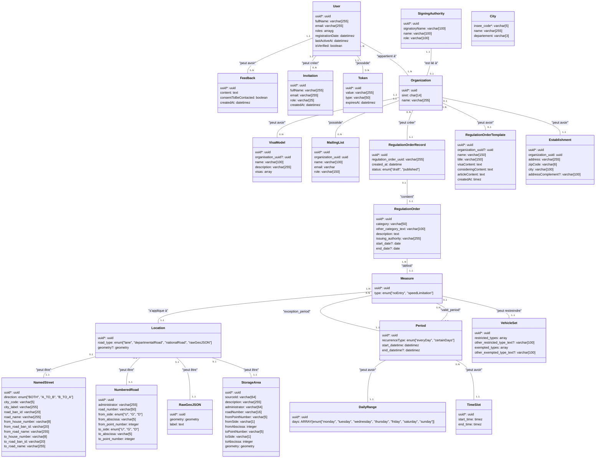

# 002 - Modèle Conceptuel de Données DiaLog

* Date : 2022-11-09
* Modifié le : 2025-06-05
* Personnes impliquées : Léa Lefoulon, Florimond Manca, Mathieu Marchois
* Statut : Accepté

## Contexte

Dans le cadre du projet DiaLog, nous sommes amenés à numériser les arrêtés de circulation. Nous avons procédé à une [analyse de l'existant](https://github.com/MTES-MCT/dialog/wiki/Analyse-de-l'existant) afin de mieux cerner la problématique métier et les différents acteurs.
Après avoir échangé avec différents calculateurs d'itinéraire comme TomTom, Here (compte rendu disponible [ici](https://pad.incubateur.net/s/uNxJar9q8#2022-10-25---TomTom-amp-Here)), il s'avère que le format qui revient le plus souvent est le [DATEXII](https://www.datex2.eu/) qui est un standard européen qui permet représenter un arrêté de circulation.

## Décision

Nous avons décidé d'orienter notre _modèle conceptuel de données_ (MCD) de telle manière qu'il puisse stocker les différentes informations relative au format DATEXII en plus de ceux qui sont plus spécifiques au fonctionnement de DiaLog comme `User` ou `Organization`.

Le diagramme ci-dessous sera modifié au fur et à mesure de l'évolution du MCD.

