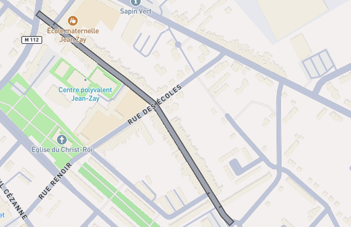
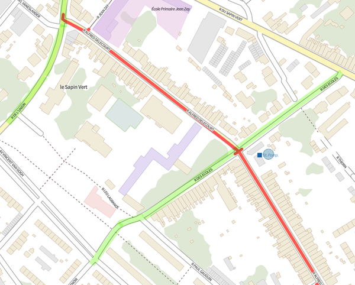

# 010 - Intégration Litteralis

* Date : 2024-07-11
* Personnes impliquées : Florimond Manca (auteur principal), équipe DiaLog (relecture)
* Statut : ACCEPTÉ <!-- [BROUILLON|ACCEPTÉ|REJETÉ|DÉPRÉCIÉ] -->

**Table des matières**

* [Contexte](#contexte)
* [Définitions](#définitions)
* [Source technique des données](#source-technique-des-données)
    * [Structure de l'API](#structure-de-lapi)
    * [Authentification](#authentification)
    * [Couches d'intérêt](#couches-dintérêt)
* [Structure des données](#structure-des-données)
    * [Contenu de la réponse de l'API](#contenu-de-la-réponse-de-lapi)
* [Gestion des erreurs](#Gestion-des-erreurs)
* [Périmètre et volumes d'intégration](#périmètre-et-volumes-dintégration)
* [Modèle d'exécution](#modèle-dexécution)
* [Paramétrage](#paramétrage)
* [Références](#références)

## Contexte

Une partie de la stratégie de DiaLog est d'intégrer des données issues de solutions existantes, notamment dans le cas de métropoles déjà équipées.

[Litteralis](https://www.sogelink.com/solution/litteralis/) est une solution de gestion réglementaire du domaine public routier éditée par Sogelink et utilisée par environ 1500 collectivités en France.

Litteralis est notamment utilisé par la MEL (Métropole Européenne de Lille) avec qui une réunion en physique a eu lieu le 29/03/2024 (voir [pad CR](https://pad.incubateur.net/MaOMoW0QS82FIj5oAABVAw#2024-03-29---Pr%C3%A9paration-visite-Lille)).

Cette ADR a pour objectif de documenter l'approche choisie pour intégrer les données de la MEL stockées dans Litteralis.

## Définitions

Les données Litteralis font intervenir 3 notions principales :

* Arrêté
* Emprise
* Mesure

Les notions d'arrêté et de mesure correspondent plutôt bien à celles de DiaLog (tables `RegulationOrder` et `Measure` de notre côté).

La notion **d'emprise**, qui est centrale dans Litteralis, n'a pas d'équivalent strict chez nous. Dans Litteralis, une emprise fait partie d'un arrêté et traduit l'application d'une ou plusieurs mesures sur une ou plusieurs localisations. Chez nous, les localisations sont _contenues par une mesure_, il n'y a pas d'entité qui contiendrait les deux comme le fait une emprise.

Ainsi, dans Litteralis :

```
Arrêté "1..N" -- "1..1" Emprise
Emprise "1..N" -- "1..1" Mesure
Emprise "1..N" -- "1..1" Localisation
```

Dans DiaLog :

```
Arrêté (`RegulationOrder`) "1..N" -- "1..1" Mesure (`Measure`)
Mesure (`Measure`) "1..N" -- "1..1" Localisation (`Location`)
```

Cette différence de structure ne pose pas vraiment de problème en pratique. Pour chaque emprise Litteralis, on créera une mesure DiaLog contenant les localisations de l'emprise.

## Source technique des données

Les données Litteralis peuvent être récupérées via une **API HTTP**.

### Structure de l'API

L'API Litteralis utilise le standard [WFS](https://www.ogc.org/standard/wfs) (Web Feature Service).

URL de base : https://apps.sogelink.fr/maplink/public/wfs?SERVICE=wfs&VERSION=2&REQUEST=GetFeature

D'autres paramètres sont à ajouter :

* `TYPENAME=...` (obligatoire) : définit la couche dont on veut récupérer les données (voir [Couches d'intérêt](#couches-dintérêt))
* `cql_filter` : permet de filtrer les données avec la syntaxe [ECQL](https://docs.geoserver.org/latest/en/user/filter/ecql_reference.html#filter-ecql-reference)
* `outputFormat=application/json` : permet de récupérer du GeoJSON (par défaut l'API renvoie du XML)

La réponse est **paginée**. On peut le voir à ces champs présents dans la réponse GeoJSON :

```json
    "totalFeatures": 16635,
    "numberMatched": 16635,
    "numberReturned": 1000,
```

Pour parcourir l'ensemble des données, on exécutera plusieurs requêtes en utilisant les paramètres WFS `count` et `startIndex`.

Par exemple pour traiter l'ensemble des points de données par groupe de 1000 :

* Requête 1 : `count=1000` et `startIndex=0`
  * On détermine le nombre total de requêtes à faire en calculant `(numberMatched // numberReturned) + 1` (dans l'exemple ci-dessus on ferait donc 17 requêtes)
* Requête 2 : `count=1000` et `startIndex=1000`
* Requête 3 : `count=1000` et `startIndex=2000`
* Etc.

### Authentification

L'API WFS de Litteralis nécessite des **identifiants** (username / password) à fournir dans la requête HTTP au format `Basic Auth`.

Ces identifiants doivent être configurés par la collectivité qui nous donne accès à ses données. Ils déterminent les données auxquelles on peut accéder (= celles de la collectivité).

La MEL a déjà configuré de tels identifiants et nous les a transmis.

### Couches d'intérêt

Les données Litteralis contiennent plusieurs "couches" (notion WFS). Toutes ne contiennent pas forcément des données pertinentes pour DiaLog.

Pour la réglementation de circulation, la couche d'intérêt est `litteralis:litteralis`.

## Structure des données

### Contenu de la réponse de l'API

La réponse contient une `FeatureCollection` où chaque `Feature` représente une **emprise**.

Exemple de `Feature` :

```json
{
    "type": "Feature",
    "id": "litteralis.401303",
    "geometry": {
        "type": "Polygon",
        "coordinates": [
            [
                [
                    3.2192232075,
                    50.7031498967
                ],
                [
                    3.2192228152,
                    50.7030601637
                ],
                [
                    3.2190815148,
                    50.7030604127
                ],
                [
                    3.2190819068,
                    50.7031501458
                ],
                [
                    3.2192232075,
                    50.7031498967
                ]
            ]
        ]
    },
    "geometry_name": "geometry",
    "properties": {
        "idemprise": 401303,
        "idarrete": 850422365,
        "shorturl": "https://dl.sogelink.fr/?RTCIgldJ",
        "arretesrcid": "2023-0656",
        "collectivitelibelle": "VILLE DE WATTRELOS",
        "collectiviteid": null,
        "collectiviteagencelibelle": "Mairie de Wattrelos",
        "collectiviteagenceid": 125777,
        "documenttype": "ARRETE TEMPORAIRE",
        "arretedebut": "2023-10-31T01:00:00Z",
        "arretefin": "2023-12-29T01:00:00Z",
        "empriseno": 1,
        "emprisetype": "CIRCULATION",
        "emprisedebut": "2023-10-31T01:00:00Z",
        "emprisefin": "2023-12-29T01:00:00Z",
        "mesures": "SOGELINK - Circulation interdite",
        "localisations": "À L'INTERSECTION DE LA RUE JEAN JAURÈS, DE LA RUE DE L'ABATTOIR, DE LA RUE DU GÉNÉRAL DE GAULLE ET DE LA RUE JEAN-BAPTISTE LEBAS",
        "idagence": 125777,
        "fournisseur": "LIPRIME",
        "publicationinternet": true,
        "emetteurlibelle": "MEL DEA Assainissement",
        "emetteurid": null,
        "categoriesmodele": "Travaux",
        "nommodele": "SOGELINK - AC2 - Arrêté temporaire travaux",
        "parametresarrete": "Date de réception de la demande : 31/10/2023 00:00:00 ; Date de début de l'arrêté : 31/10/2023 00:00:00 ; Date de fin de l'arrêté : 29/12/2023 00:00:00 ; Description des travaux : sur réseaux ou ouvrages d'eaux usées / assainissement ; ajout annexe : N ; chargé de MEP de la signalisation : Le demandeur de l'acte",
        "parametresemprise": "Dates de l'emprise : Du 31/10/2023 00:00:00 au 29/12/2023 00:00:00",
        "parametresmesures": "SOGELINK - Circulation interdite | dérogations : véhicules de l'entreprise exécutant les travaux",
        "datecreation": "2023-10-31T10:29:53.053Z",
        "datemodification": "2023-10-31T10:29:55.326Z"
    },
    "bbox": [
        3.2190815148,
        50.7030601637,
        3.2192232075,
        50.7031501458
    ]
}
```

Les champs pertinents sont les suivants (les descriptions s'inspirent de la documentation Litteralis). Les indications "Check qualité" correspondent à des vérifications de cohérence des données source ; si un data check échoue, cela constituera un cas d'erreur.

* `geometry` : géométrie GeoJSON de l'emprise telle que dessinée par l'agent dans Litteralis, en coordonnées standard `EPSG:4326`. Empiriquement, peut être de type `Polygon` ou bien `MultiPolygon` (voir "localisations multiples" ci-dessous).
* `idarrete` : identifiant unique de l'arrêté dans Litteralis. En regroupant les features par `idarrete` on obtient la liste des emprises par arrêté.
* `idemprise` : identifiant unique de l'emprise dans Litteralis.
    * **Check qualité** : la réponse doit contenir une seule `Feature` par `idemprise`.
* `shorturl` : lien vers le PDF de l'arrêté papier.
* `arretesrcid` : numéro de l'arrêté, non-unique et propre à l'organisation émettrice. Cela correspond à la notion d'identifiant arrêté (champ `identifier`) dans DiaLog.
    * **Check qualité** : le `arretesrcid` des features d'un même arrêté doit être identique.
* `collectiviteagencelibelle` : nom de la collectivité qui a produit l'arrêté
    * **Check qualité** : le nom de collectivité des features d'un même arrêté doit être identique.
* `documenttype` : 3 valeurs possibles (définies dans la doc Litteralis) : `ARRETE TEMPORAIRE`, `ARRETE PERMANENT` ou `AUTORISATION VOIRIE`
* `arretedebut` : date de début de l'arrêté dont fait partie l'emprise
    * **Check qualité** : format ISO8601
* `arretefin` : date de fin de l'arrêté dont fait partie l'emprise
   * **Check qualité** : format ISO8601, non-vide si et seulement si l'arrêté est temporaire, située strictement plus tard que `arretedebut`
* `emprisetype` : "Le type de l’emprise parmi les valeurs suivantes : `STATIONNEMENT`, `CIRCULATION`, `OCCUPATION`, `DEVIATION`."
* `emprisedebut` et `emprisefin` : dates de début et de fin de l'emprise, non-null uniquement si elles diffèrent de celles de l'arrêté
   * **Check qualité** : format ISO8601 ; les deux doivent être définies ou bien être `null` (pas de début sans fin ni inversement) ; `emprisefin` située strictement plus tard que `emprisedebut`.
* `mesures` : nom des mesures qui s'appliquent sur cette emprise. Peut contenir plusieurs valeurs séparées par des `;`.
* `localisations` : "Liste des localisations de l'emprise. Peut contenir plusieurs valeurs séparées par des `;`." Exemple : `AVENUE DENIS CORDONNIER (LILLE) - FACE AUX 7 BIS - 90 - 176 ; BOULEVARD DE VERDUN (LILLE) - OPP AU 127;`.
* `categoriesmodele` : "Tel que défini par l’instructeur de l’arrêté dans Littéralis parmi les valeurs suivantes : travaux" (982 sur un échantillon de 1000 emprises), "réglementation permanente" (3 sur 1000), "ODP" (en fait Evenements, 15 sur 1000). Peut correspondre à la `Catégorie` au sens de DiaLog.
* `parametresarrete` : "Liste des informations de l'emprise et leur valeur. L'information est séparée de sa valeur par un `:` et chacun des couples information / valeur est séparé par un `;`."
    * **Check qualité** : les emprises d'un même arrêté ont des `parametresarrete` identiques
* `parametresmesures` : "Liste des informations des mesures de circulation / stationnement (pour les `ARRETES`) ou des natures (pour les `AUTORISATION DE VOIRIE`) et leur valeur. Le nom de la mesure (avec un numéro à partir de la deuxième s'il y en a plusieurs) est séparé de l'information par un `|` et l'information est séparée de sa valeur par un `:`. Enfin chacun des couples « mesure | information : valeur » est séparé par un `;`."

Le champ `parametresemprise` est vide la plupart du temps et contient sinon les dates de l'emprise, redondant avec `emprisedebut` et `emprisefin`.

#### Analyse de la `geometry`

Le champ `geometry` contient une géométrie de type `Polygon` ou `MultiPolygon`.

Dans Litteralis, les géométries sont dessinées par les utilisateurs au moyen de polygones qui couvrent les rues concernées, le plus souvent sous forme de "couloirs".

Exemple :



Dans DiaLog, on stockes les géométries sous forme de linéaires.

On souhaite donc convertir ces polygones "couloirs" en linéaires.

Pour cela, on calculera l'intersection entre le(s) polygone(s) et `troncon_de_route`.

Cette opération génèrera des portions de tronçon parasites au niveau des rues adjacentes à la voie principale couverte par le polygone. Retirer ces tronçons parasites nécessite une opération géométrique qui soit rapide et robuste. Intuitivement une comparaison entre la longueur de la portion et la "largeur" locale du "couloir" pourrait fonctionner. Mais en raison de la complexité de réaliser ce calcul de façon robuste, on propose de reporter son développement.

Exemple :



#### Analyse du champ `localisations`

En principe, il y autant d'items dans `localisations` que de polygones dans `geometry`.

Par soucis de simplicité et de robustesse du code, on ne cherchera pas vérifier la cohérence de ces deux listes ni à inspecter le contenu de `geometry`.

On utilisera le type `RawGeoJSON` dont le label prendra la valeur du champ `localisations`, et la géométrie la valeur de `geometry` traitée comme un GeoJSON "opaque".

#### Analyse du champ `parametresarrete`

La plupart des informations sont relatives au cycle de vie de l'arrêté ou du chantier et n'ont pas de correspondance dans DiaLog

Certaines informations peuvent alimenter la `description` de l'arrêté :

* `Description des travaux`
* `Description de l'évènement`

#### Analyse des champs `mesures` et `parametresmesures`

##### Valeurs possibles

Liste des mesures observées sur un échantillon de 1000 emprises :

_(Entre parenthèses : le nombre d'occurrences. En gras : les types qui peuvent être intégrés à DiaLog à date)_

* ATP - Assainissement (190)
* ATP - Autres réseaux (11)
* ATP - Chauffage urbain (1)
* ATP - Eau potable (136)
* ATP - Electricité (192)
* ATP - Gaz (171)
* ATP - Télécommunications (26)
* ATP - Vidéosurveillance (1)
* ATP - Végétalisation (1)
* ATU - Eau potable (5)
* ATU - Electricité (4)
* ATU - Gaz (25)
* ATU - Télécommunications (3)
* Circulation alternée (5)
* **Circulation interdite** (11)
* Déviation (12)
* Interdiction de dépasser (16)
* Interdiction de stationnement (26)
* **Limitation de vitesse** (22)
* Mesure libre circulation (7)
* Neutralisation de voie (11)
* Rétrécissement de largeur de voie (2)
* SOGELINK - Circulation alternée (10)
* **SOGELINK - Circulation interdite** (26)
* SOGELINK - Circulation à double sens (4)
* SOGELINK - Déviation (8)
* SOGELINK - Interdiction de dépasser (14)
* SOGELINK - Interdiction de stationnement (74)
* SOGELINK - Interruption de circulation travaux (1)
* **SOGELINK - Limitation de vitesse** (15)
* SOGELINK - Mesure libre circulation (5)
* SOGELINK - Mesure libre stationnement (4)
* SOGELINK - Mise en impasse (1)
* SOGELINK - Neutralisation de voie (1)
* SOGELINK - Parcours ou situation de l'événement (1)
* SOGELINK - Rétrécissement temporaire de largeur de voie (45)
* SOGELINK - Sens interdit (ou sens unique) (2)
* SOGELINK - Stationnement CERFA (3)
* SOGELINK - Stationnement hors travaux (7)
* SOGELINK - Stationnement pour travaux (27)
* Stationnement pour travaux (1)
* Voie réservée (1)

##### Obtention des informations d'une mesure donnée

On peut récupérer les informations d'une mesure donnée en regroupant les informations de `parametresmesures` par mesure.

Exemple : dans l'emprise 394604, `mesures` vaut "SOGELINK - Interdiction de stationnement;SOGELINK - Circulation interdite", et `parametresmesures` vaut :

> SOGELINK - Interdiction de stationnement 2 | jours et horaires : de 08 h 00 à 18 h 00 ; SOGELINK - Interdiction de stationnement 2 | dérogations : véhicules de l'entreprise exécutant les travaux ; SOGELINK - Interdiction de stationnement 2 | caractère aggravant : gênant ; SOGELINK - Interdiction de stationnement 2 | fourrière  : Oui ; SOGELINK - Circulation interdite | jours et horaires : de 08 h 00 à 18 h 00 ; SOGELINK - Circulation interdite | dérogations : véhicules de l'entreprise exécutant les travaux

On voit que la numérotation ne suit pas forcément l'ordre dans la liste : "interdiction de stationnement **2**" mais l'interdiction de stationnement est en premier dans `mesures`. Ce sera à prendre en compte.

On peut regrouper par nom de mesure et obtenir ainsi les informations par mesure :

* `Interdiction de stationnement 2` => "jours et horaires : de 08 h 00 à 18 h 00 ; dérogations : véhicules de l'entreprise exécutant les travaux ; caractère aggravant : gênant ; fourrière  : Oui"
* `SOGELINK - Circulation interdite` => "jours et horaires : de 08 h 00 à 18 h 00 ; dérogations : véhicules de l'entreprise exécutant les travaux"

##### Informations notables

Les informations sur les **véhicules concernés** sont présentes dans `parametresmesures`. Ils semblent séparés par des `,`. Exemples :

* `SOGELINK - Circulation interdite | véhicules concernés : véhicules de plus de 3.5 tonnes`
* `SOGELINK - Circulation interdite | véhicules concernés : piétons, cycles,poids lourds,véhicules légers`

De même on a les informations sur les **véhicules exemptés** (séparés par `,`) avec l'information `dérogations` :

* `SOGELINK - Circulation interdite | dérogations : véhicules relevant de l'organisation de l'événement`
* `SOGELINK - Circulation interdite | dérogations : véhicules de police,véhicules de secours,véhicules de l'entreprise exécutant les travaux`

Les **périodes** sont précisées dans l'information `jours et horaires`, mais le format n'est pas forcément standardisé :

* Format quasi-standardisé pour un créneau horaire seul
    * `SOGELINK - Circulation interdite | jours et horaires : de 08 h 00 à 18 h 00`
    * `jours et horaires : de 10h45 à 11h30`
    * `jours et horaires : DE 10H45 À 11H30` (H en majuscule)
* Format NON STANDARDISÉ dans le cas où seulement certains jours sont concernés
    * `SOGELINK - Circulation interdite | jours et horaires : la journée` (???)
    * `SOGELINK - Circulation interdite 3 | jours et horaires : du lundi au vendredi de 7h30 à 17h30`
    * `SOGELINK - Circulation interdite | jours et horaires : Samedis, Dimanches et jours fériés ainsi que les jours de semaine de 17h30 à 8h00`
    * De nuit
        * `jours et horaires : de nuit entre 21H00 et 5H00`
        * `jours et horaires : travaux de nuit de 21H00 à 6H00` (pas de `NOM MESURE |`)

La **vitesse** d'une limitation de vitesse est indiquée dans l'information `limite de vitesse` :

* `Limitation de vitesse 4 | limite de vitesse : 30 km/h`

## Gestion des erreurs

Les erreurs et autres problèmes que l'on pourrait rencontrer pendant le traitement des données Litteralis seront traitées :

1. Affichage dans le fichier de log de l'intégration (à ce stade seulement disponible sur l'ordinateur où l'intégration a été lancée)
2. Constitution d'un rapport d'erreur "pretty print"

## Périmètre et volumes d'intégration

L'intégration Litteralis inspectera les [couches d'intérêt](#couches-dintérêt) identifiées, à savoir `litteralis:litteralis` uniquement.

Dans chaque couche, elle récupèrera **toutes les emprises** de l'organisation **dont la date de fin (de l'arrêté ou de l'emprise) est dans le futur** (voir [Structure de l'API](#structure-de-lapi) pour l'approche de parcours intégral de l'API).

Au sein d'une emprise, on intègrera **uniquement les mesures connues de DiaLog**, à savoir Circulation interdite et Limitation de vitesse.

On intègrera **toutes les localisations** d'une emprise.

Avant chaque exécution de l'intégration, on supprimera les arrêtés de l'organisation cible où `source = 'litteralis'` et dont la date de fin est dans le futur. Cela permet de conserver sans y toucher les arrêtés devenus passés.

## Modèle d'exécution

L'intégration Litteralis sera dans un premier temps exécutée manuellement en exécutant la commande spécifique à la collectivité, tel que décrite ci-dessus.

On pourra ensuite envisager une automatisation grâce à GitHub Actions, sur le modèle de l'intégration Eudonet Paris.

## Paramétrage

L'intégration Litteralis prendra comme paramètres d'entrée :

* L'UUID de l'organisation cible dans laquelle intégrer les données (par exemple celui de l'organisation "MEL")
* Les identifiants de l'API configurés par la collectivité

Ces paramètres d'entrée pourront être définies par un jeu variables d'environnement spécifique à chaque collectivité dont on veut intégrer les données Litteralis.

Par exemple pour la MEL, on pourra créer une commande Symfony qui à exécuter en ligne de commande comme ceci :

```bash
make console CMD="app:mel:import"
```

Cette commande spécifique ira par exemple lire les variables d'environnement `APP_MEL_ORG_ID`, `APP_MEL_LITTERALIS_CREDENTIALS` et les passera à l'intégration Litteralis.

## Références

* [Documentation du Flux WFS Litteralis](https://kdrive.infomaniak.com/app/drive/184671/files/53093/preview/pdf/53094)
