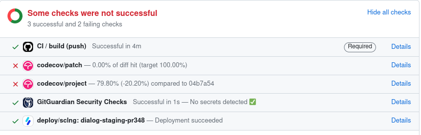

# Déploiement

Nous utilisons [Scalingo](https://dashboard.scalingo.com/) pour gérer les déploiements de DiaLog.

## Prérequis

Pour pouvoir faire un déploiement depuis Scalingo, vous devez au préalable avoir un compte avec une adresse `@beta.gouv.fr`.

Un membre de l'équipe doit ensuite vous ajouter à l'organisation DiaLog.

## 🚀 Production

URL : https://dialog.beta.gouv.fr

L'environnement de production est automatiquement déployé lors d'un _push_ sur la branche `main`.

Accédez au détail du _build_ sur le [dashboard Scalingo](https://dashboard.scalingo.com/appmas/osc-fr1/dialog/) ou accédez à https://dialog.beta.gouv.fr pour vérifier que le déploiement s'est bien déroulé.

## 🛠️ Staging

URL : https://dialog.incubateur.net/

L'environnement staging est automatiquement déployé lors d'un _push_ sur la branche `main`.

Il peut aussi être déployé manuellement :

* Allez sur le [dashboard Scalingo](https://dashboard.scalingo.com/apps/osc-fr1/dialog-staging) ;
* Cliquez sur [`Deploy`](https://dashboard.scalingo.com/apps/osc-fr1/dialog-staging/deploy/list) puis sur [`Manual deployments`](https://dashboard.scalingo.com/apps/osc-fr1/dialog-staging/deploy/manual) ;
* Selectionnez la branche que vous voulez déployer puis cliquez sur `Trigger deployment`.

Utilisez le [dashboard Scalingo](https://dashboard.scalingo.com/apps/osc-fr1/dialog-staging) ou accédez à https://dialog.incubateur.net pour vérifier que le déploiement s'est bien déroulé.

## Environnements de branche

Lorsque vous créez une _pull request_, une application dédiée ("_Review App_") est automatiquement créée à partir de l'application staging puis déployée par Scalingo.

Cela permet par exemple de partager à d'autres membres de l'équipe la version déployée d'un travail en cours afin de collecter leurs retours.

Vous pouvez trouver l'URL d'une application de branche grâce à la [liste des applications sur Scalingo](https://dashboard.scalingo.com/apps), ou bien en cliquant sur le lien "Details" du check `deploy/sclng`, en bas de la PR :



## Contenu d'un environnement

### Architecture

L'infrastructure d'un environnement est déployée et gérée par Scalingo et s'articule comme suit :

* Le [buildpack PHP](https://doc.scalingo.com/languages/php/start) orchestre un conteneur appelé `web` qui contient :
  * Le serveur PHP qui fait tourner l'application Symfony.
  * Un Nginx placé devant le serveur PHP. On peut [modifier la configuration Nginx](https://doc.scalingo.com/languages/php/start#buildpack-custom-configuration).
* Le serveur PHP communique avec la base de données PostgreSQL.
* Le serveur PHP communique avec la base de données Redis, notamment pour le stockage des sessions utilisateurs.
* Le serveur PHP communique avec des services tiers :
  * API Adresse : géocodage d'adresses.
  * Sentry : collecte et analyse des erreurs applicatives.
  * Matomo : collecte et analyse de données de trafic utilisateur.

Diagramme :

```
                    Scalingo
        ┌---------------------------------┐  ┌ - - - - - - ┐
WWW ------ nginx (:443) --- php --------┬----  API Adresse  
        |                    |          | |  └ - - - - - - ┘
        |               ┌----┴----┐     | |  ┌ - - - -┐
        |           ┌ - ┴ - ┐ ┌ - ┴ - ┐ ├----  Sentry  
        |             PgSQL     Redis   | |  └ - - - -┘
        |           └ - - - ┘ └ - - - ┘ | |  ┌ - - - -┐
        |                               └----  Matomo  
        └---------------------------------┘  └ - - - -┘           
```

### Ressources

Voici, à date, une liste des ressources utilisées dans un environnement.

| Ressource | Localisation | Contact |
|-----------|------|---------|
| Application Scalingo | Scalingo BetaGouv | tristan.robert[ @ ]beta.gouv.fr |
| Base de données PostgreSQL | Scalingo BetaGouv (add-on) | tristan.robert[ @ ]beta.gouv.fr |
| Serveur Redis | Scalingo BetaGouv (add-on) | tristan.robert[ @ ]beta.gouv.fr |
| Enregistrement DNS | Zone DNS de BetaGouv | tristan.robert[ @ ]beta.gouv.fr |
| Projet Sentry | [Sentry de BetaGouv](https://sentry.incubateur.net) | tristan.robert[ @ ]beta.gouv.fr |
| Site Matomo | [Matomo BetaGouv](https://stats.beta.gouv.fr) | ~incubateur-ops |

### Configuration

Chaque application peut être configurée avec les variables d'environnement suivantes, dont certaines sont obligatoires. Elles sont listées dans l'ordre alphabétique.

| Variable d'environnement | Description | Valeur par défaut | Notes |
|--------------------------|-------------|--------|-------|
| `API_ADRESSE_BASE_URL` | URL de l'instance API Adresse / Addok à utiliser | _(Obligatoire)_ | Exemple : `https://api-adresse.data.gouv.fr` |
| `APP_EUDONET_PARIS_BASE_URL` | URL de l'API Eudonet Paris | https://eudonet.apps.paris.fr | |
| `APP_EUDONET_PARIS_ORG_ID` | Utiliser l'UUID de l'organisation Ville de Paris | _Vide_ | |
| `APP_SECRET` | Correspond au paramètre Symfony [`secret`](https://symfony.com/doc/current/reference/configuration/framework.html#secret) | _(Obligatoire)_ | Longueur recommandée : 32 caractères. Exemple : générer avec `python3 -c 'import secrets; print(secrets.token_hex(16))'` |
| `DATABASE_URL` | URL vers le serveur PostgreSQL | _(Obligatoire)_ `$SCALINGO_POSTGRESQL_URL` | La variable `$SCALINGO_POSTGRESQL_URL` est configurée automatiquement par Scalingo |
| `MATOMO_ENABLED` | `true` (ou autre valeur truthy) pour activer les [analytics](../tools/analytics.md), `false` pour ne pas les activer | `false` | |
| `PHP_BUILDPACK_NO_NODE` | Désactive le support Node.js dans le buildpack PHP, puisqu'on utilise le buildpack Node.js complet (voir `.buildpacks`). | _(Obligatoire)_ `true` | Voir : [PHP application with Node.js (Scalingo docs)](https://doc.scalingo.com/languages/php/php-nodejs) |
| `REDIS_URL` | URL vers le serveur Redis | _(Obligatoire)_ `$SCALINGO_REDIS_URL` | La variable `$SCALINGO_REDIS_URL` est configurée automatiquement par Scalingo |
| `SENTRY_DSN` | URL de collecte Sentry | | À récupérer sur l'instance Sentry. Voir : [Monitoring](../tools/monitoring.md) |
| `WEB_CONCURRENCY` | Nombre de processus enfants créés par PHP-FPM (`pm.max_children`). | Dépend de la `memory_limit` et de la RAM de la machine. | Utiliser `2`. Peut être ajusté pour optimiser le fonctionnement du serveur. Voir : [PHP-FPM Concurrency (Scalingo docs)](https://www.php.net/manual/fr/install.fpm.configuration.php) |
| `ADMIN_EMAIL` | Adresse email de l'administrateur | _(Obligatoire)_ mathieu.fernandez@beta.gouv.fr | |

## Retirer un environnement

Lorsqu'un environnement décrit ci-dessus n'est plus utile, il devrait être retiré pour libérer les ressources informatiques associées.

Pour ce faire :

* S'assurer que l'environnement n'est effectivement plus utilisé et qu'il peut être supprimé définitivement.
* Débrancher le nom de domaine de l'application.
* Retirer l'application sur Scalingo. Cela libèrera aussi les add-ons associés (PostgreSQL, Redis).
* Supprimer le projet Sentry correspondant.
* Mettre à jour la présente documentation.

En cas de problèmes de permissions, demander l'aide de tristan.robert[ @ ]beta.gouv.fr.
